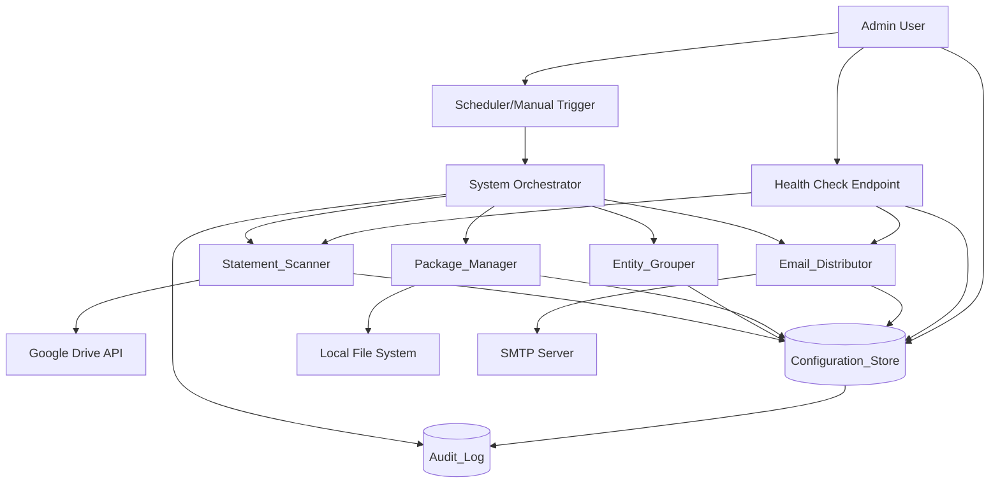
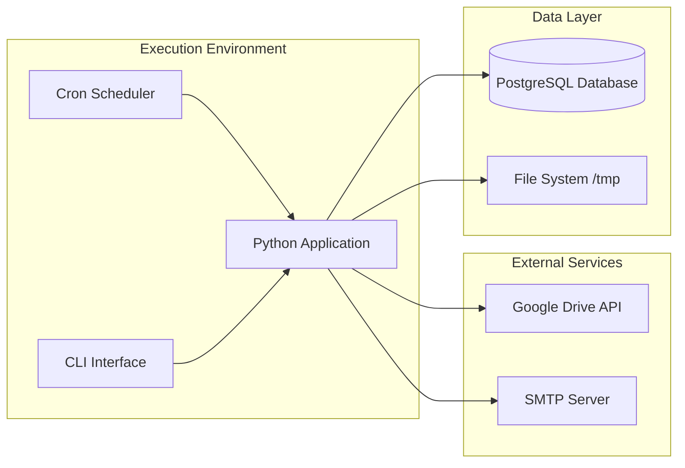
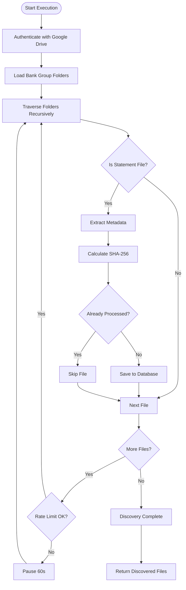
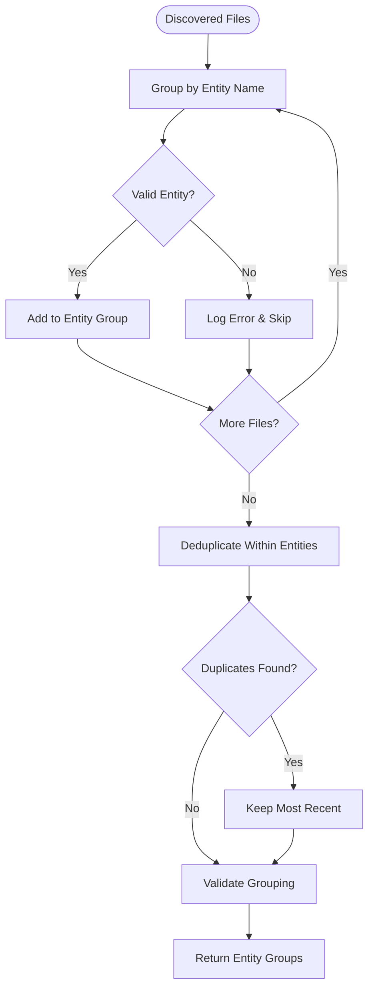
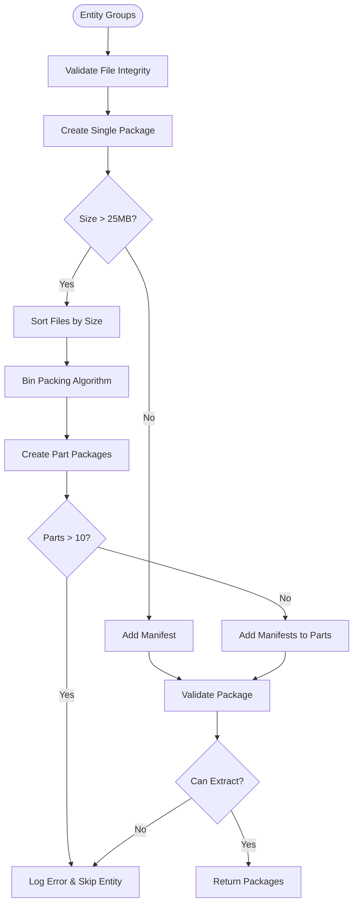
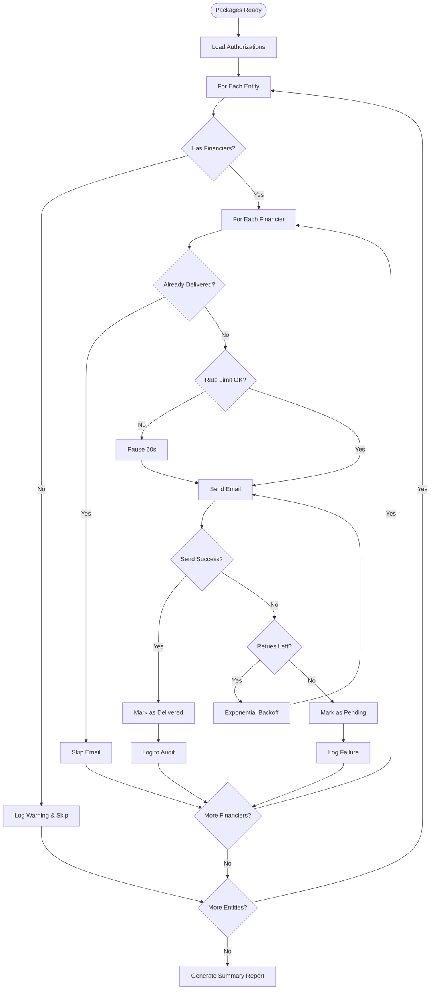

# Design Document: Bank Statement Distribution System

## Overview

The Bank Statement Distribution System is a production-grade automation platform that orchestrates the monthly distribution of bank statements from Google Drive to authorized financiers via email. The system transforms a manual 2-4 hour process into a secure, auditable, and fault-tolerant automated workflow.

### Core Capabilities

- **Automated Discovery**: Scans Google Drive folders to identify new bank statements
- **Entity-Based Regrouping**: Reorganizes statements from bank-centric to entity-centric grouping
- **Intelligent Packaging**: Creates compressed archives with automatic splitting for email size limits
- **Authorized Distribution**: Delivers statements only to authorized financiers with comprehensive audit trails
- **Fault Tolerance**: Implements retry logic, state persistence, and graceful error handling
- **Security**: Encrypts credentials, validates file integrity, and maintains comprehensive audit logs

### Design Principles

1. **Idempotency**: All operations can be safely retried without duplicate deliveries
2. **Fault Isolation**: Component failures don't cascade; partial success is preserved
3. **Auditability**: Every operation is logged with complete traceability
4. **Security-First**: Credentials encrypted, access controlled, data integrity validated
5. **Configuration-Driven**: New financiers and entities added without code changes
6. **Production-Ready**: Enterprise-grade reliability, monitoring, and error handling

## Architecture

### System Architecture Diagram



### Component Architecture

The system follows a pipeline architecture with six primary components:

1. **System Orchestrator**: Coordinates execution flow, manages state transitions, generates summary reports
2. **Statement_Scanner**: Discovers and catalogs statement files from Google Drive
3. **Entity_Grouper**: Reorganizes statements from bank-based to entity-based associations
4. **Package_Manager**: Creates compressed archives with intelligent splitting
5. **Email_Distributor**: Sends packages to authorized financiers with retry logic
6. **Configuration_Store**: Persistent storage for configuration, state, and audit data

### Deployment Architecture



## Technology Stack

### Core Platform

- **Python Version**: Python 3.11+
  - Rationale: Mature async support, type hints, performance improvements
  - Long-term support through 2027


### Key Libraries

#### Google Drive Integration
- **google-api-python-client** (v2.100+): Official Google Drive API client
- **google-auth** (v2.23+): OAuth2 authentication and credential management
- **google-auth-oauthlib** (v1.1+): OAuth2 flow for user authorization
- **google-auth-httplib2** (v0.1+): HTTP transport for Google APIs

#### Email and SMTP
- **aiosmtplib** (v3.0+): Async SMTP client for non-blocking email sending
- **email** (stdlib): MIME message construction and attachment handling
- **email-validator** (v2.1+): RFC 5322 email address validation

#### Database
- **SQLAlchemy** (v2.0+): ORM and database abstraction layer
- **alembic** (v1.12+): Database migration management
- **psycopg2-binary** (v2.9+): PostgreSQL adapter (production)
- **aiosqlite** (v0.19+): Async SQLite support (development/testing)

#### File Processing
- **zipfile** (stdlib): ZIP archive creation with DEFLATE compression
- **hashlib** (stdlib): SHA-256 checksum calculation
- **PyPDF2** (v3.0+): PDF validation and metadata extraction
- **openpyxl** (v3.1+): Excel file validation (.xlsx)
- **xlrd** (v2.0+): Legacy Excel file validation (.xls)

#### Scheduling and Async
- **APScheduler** (v3.10+): Job scheduling with cron-like triggers
- **asyncio** (stdlib): Async/await support for concurrent operations

#### Configuration and Security
- **cryptography** (v41.0+): AES-256 encryption for credentials
- **python-dotenv** (v1.0+): Environment variable management
- **pydantic** (v2.4+): Configuration validation and settings management

#### Logging and Monitoring
- **structlog** (v23.2+): Structured logging with JSON output
- **prometheus-client** (v0.18+): Metrics export for monitoring
- **fastapi** (v0.104+): Health check HTTP endpoint
- **uvicorn** (v0.24+): ASGI server for health endpoint

### Database Selection

**Recommended: PostgreSQL 14+**

Rationale:
- **ACID Compliance**: Critical for financial audit trails
- **JSON Support**: Native JSONB for flexible audit log storage
- **Concurrent Access**: Multiple process instances can safely access shared state
- **Reliability**: Proven in production finance systems
- **Backup/Recovery**: Point-in-time recovery for audit compliance
- **Performance**: Efficient indexing for audit log queries

Alternative Options:
- **MySQL 8.0+**: Viable alternative with similar features, slightly less robust JSON support
- **SQLite**: Only for development/testing; not suitable for production (no concurrent writes)

### Deployment Platform

**Recommended: Docker Container on Linux VM**

Rationale:
- **Portability**: Consistent environment across dev/staging/production
- **Isolation**: Dependencies contained, no system-level conflicts
- **Scalability**: Easy to scale horizontally if needed
- **Monitoring**: Standard container metrics and logging

Deployment Options:
1. **AWS ECS/Fargate**: Managed container orchestration, integrated with CloudWatch
2. **Google Cloud Run**: Serverless container execution, auto-scaling
3. **Azure Container Instances**: Simple container deployment
4. **On-Premise VM**: Docker on Ubuntu 22.04 LTS with systemd service

### Scheduler

**Recommended: APScheduler with CronTrigger**

Rationale:
- **Python-Native**: No external dependencies, runs in-process
- **Flexible**: Supports cron expressions, interval triggers, and manual execution
- **Persistent**: Can store job state in database for recovery
- **Lightweight**: No separate daemon process required

Implementation:
```python
from apscheduler.schedulers.asyncio import AsyncIOScheduler
from apscheduler.triggers.cron import CronTrigger

scheduler = AsyncIOScheduler()
scheduler.add_job(
    run_distribution_pipeline,
    CronTrigger(day=1, hour=0, minute=0, timezone='UTC'),
    id='monthly_distribution',
    replace_existing=True
)
```

Alternative: System cron with CLI invocation for simpler deployments

## Components and Interfaces

### Component 1: Statement_Scanner

**Responsibility**: Discover and catalog bank statement files from Google Drive


#### Interface

```python
class StatementScanner:
    async def authenticate(self) -> bool:
        """Authenticate with Google Drive API using OAuth2 credentials."""
        
    async def scan_folders(self, bank_groups: List[str]) -> List[StatementFile]:
        """
        Scan configured bank group folders for statement files.
        
        Args:
            bank_groups: List of Google Drive folder IDs to scan
            
        Returns:
            List of discovered StatementFile objects with metadata
            
        Raises:
            AuthenticationError: If Google Drive authentication fails
            QuotaExceededError: If API quota is exceeded
        """
        
    async def extract_metadata(self, file_id: str) -> StatementMetadata:
        """Extract metadata from a discovered file."""
        
    async def calculate_checksum(self, file_id: str) -> str:
        """Calculate SHA-256 checksum for file integrity validation."""
```

#### Implementation Details

**Authentication Flow**:
1. Load encrypted OAuth2 credentials from Configuration_Store
2. Decrypt credentials using AES-256 with stored key
3. Initialize Google Drive API client with credentials
4. Validate authentication with test API call
5. Implement token refresh logic for long-running operations

**File Discovery Algorithm**:
```python
async def scan_folders(self, bank_groups: List[str]) -> List[StatementFile]:
    discovered_files = []
    rate_limiter = RateLimiter(max_requests=10, window=1.0)  # 10 req/sec
    
    for bank_group_id in bank_groups:
        async for file in self._traverse_folder(bank_group_id, depth=0, max_depth=10):
            await rate_limiter.acquire()
            
            if file.extension in ['.pdf', '.csv', '.xls', '.xlsx']:
                metadata = await self.extract_metadata(file.id)
                checksum = await self.calculate_checksum(file.id)
                
                statement_file = StatementFile(
                    file_id=file.id,
                    file_path=file.path,
                    bank_name=self._extract_bank_name(file.path),
                    entity_name=self._extract_entity_name(file.path),
                    file_size=file.size,
                    modified_at=file.modified_time,
                    checksum=checksum
                )
                
                discovered_files.append(statement_file)
    
    return self._deduplicate_files(discovered_files)
```

**Metadata Extraction**:
- **Bank Name**: Extract from level 1 parent folder name
- **Entity Name**: Extract from level 2 parent folder name
- **File Path**: Full path from root to file
- **File Size**: Size in bytes from Drive API
- **Modified Timestamp**: ISO 8601 format from Drive API

**Rate Limiting**:
- Token bucket algorithm: 10 requests/second
- Pause at 80% threshold (8 req/sec) for 60 seconds
- Exponential backoff on quota exceeded errors (300 second pause)

**Error Handling**:
- Authentication failures: Retry 3 times with exponential backoff (1s, 2s, 4s)
- Permission errors: Log and skip folder, continue with remaining
- Network timeouts: Classify as transient, retry with backoff
- Quota exceeded: Pause 300 seconds, then resume

### Component 2: Entity_Grouper

**Responsibility**: Reorganize statements from bank-based to entity-based associations


#### Interface

```python
class EntityGrouper:
    async def group_by_entity(self, files: List[StatementFile]) -> Dict[str, List[StatementFile]]:
        """
        Group statement files by entity name.
        
        Args:
            files: List of discovered statement files
            
        Returns:
            Dictionary mapping entity names to lists of statement files
            
        Raises:
            ValidationError: If files have missing or invalid entity metadata
        """
        
    async def validate_grouping(self, groups: Dict[str, List[StatementFile]]) -> bool:
        """Validate that each file belongs to exactly one entity."""
```

#### Implementation Details

**Grouping Algorithm**:
```python
async def group_by_entity(self, files: List[StatementFile]) -> Dict[str, List[StatementFile]]:
    entity_groups: Dict[str, List[StatementFile]] = defaultdict(list)
    
    for file in files:
        if not file.entity_name or file.entity_name.strip() == "":
            logger.error(f"Missing entity name for file: {file.file_path}")
            continue
            
        entity_groups[file.entity_name].append(file)
    
    # Validate no duplicates within each entity
    for entity, entity_files in entity_groups.items():
        entity_groups[entity] = self._deduplicate_within_entity(entity_files)
    
    await self.validate_grouping(entity_groups)
    return dict(entity_groups)
```

**Deduplication Logic**:
```python
def _deduplicate_within_entity(self, files: List[StatementFile]) -> List[StatementFile]:
    """Remove duplicate files within an entity based on name and checksum."""
    seen = {}
    unique_files = []
    
    for file in files:
        key = (file.file_name.lower(), file.checksum)
        
        if key not in seen:
            seen[key] = file
            unique_files.append(file)
        else:
            # Keep file with most recent modification time
            existing = seen[key]
            if file.modified_at > existing.modified_at:
                unique_files.remove(existing)
                unique_files.append(file)
                seen[key] = file
            elif file.modified_at == existing.modified_at:
                # Tie-breaker: longest path (lexicographically)
                if len(file.file_path) > len(existing.file_path):
                    unique_files.remove(existing)
                    unique_files.append(file)
                    seen[key] = file
    
    return unique_files
```

**Data Structures**:
- Input: `List[StatementFile]` from Statement_Scanner
- Output: `Dict[str, List[StatementFile]]` mapping entity names to file lists
- Preserves all metadata: file_path, file_size, modified_at, checksum

### Component 3: Package_Manager

**Responsibility**: Create compressed archives with intelligent splitting for email limits


#### Interface

```python
class PackageManager:
    async def create_packages(
        self, 
        entity_groups: Dict[str, List[StatementFile]],
        max_size_mb: int = 25
    ) -> Dict[str, List[Package]]:
        """
        Create compressed packages for each entity with automatic splitting.
        
        Args:
            entity_groups: Dictionary mapping entity names to file lists
            max_size_mb: Maximum package size in MB (default 25MB)
            
        Returns:
            Dictionary mapping entity names to lists of Package objects
            
        Raises:
            CompressionError: If ZIP creation fails
            ValidationError: If package validation fails
        """
        
    async def validate_package(self, package_path: str) -> bool:
        """Validate package integrity by extracting first file."""
        
    async def create_manifest(self, files: List[StatementFile]) -> str:
        """Create manifest.txt with file names, sizes, and checksums."""
```

#### Implementation Details

**Package Creation Algorithm**:
```python
async def create_packages(
    self, 
    entity_groups: Dict[str, List[StatementFile]],
    max_size_mb: int = 25
) -> Dict[str, List[Package]]:
    packages = {}
    max_size_bytes = max_size_mb * 1024 * 1024
    
    for entity, files in entity_groups.items():
        # Validate files before packaging
        valid_files = await self._validate_files(files)
        
        if not valid_files:
            logger.error(f"No valid files for entity {entity}")
            continue
        
        # Try single package first
        single_package = await self._create_single_package(entity, valid_files)
        
        if single_package.size <= max_size_bytes:
            packages[entity] = [single_package]
        else:
            # Split into multiple packages
            split_packages = await self._split_packages(entity, valid_files, max_size_bytes)
            packages[entity] = split_packages
    
    return packages
```

**File Splitting Strategy**:
```python
async def _split_packages(
    self,
    entity: str,
    files: List[StatementFile],
    max_size: int
) -> List[Package]:
    """Split files into multiple packages under size limit."""
    packages = []
    current_batch = []
    current_size = 0
    part_number = 1
    
    # Sort files by size (largest first) for better bin packing
    sorted_files = sorted(files, key=lambda f: f.file_size, reverse=True)
    
    for file in sorted_files:
        # Skip files larger than max_size
        if file.file_size > max_size:
            logger.error(f"File {file.file_path} exceeds {max_size} bytes, excluding")
            continue
        
        # Estimate compressed size (assume 70% compression for PDFs)
        estimated_compressed = int(file.file_size * 0.7)
        
        if current_size + estimated_compressed > max_size and current_batch:
            # Create package from current batch
            package = await self._create_package_from_batch(
                entity, current_batch, part_number
            )
            packages.append(package)
            
            current_batch = [file]
            current_size = estimated_compressed
            part_number += 1
        else:
            current_batch.append(file)
            current_size += estimated_compressed
    
    # Create final package
    if current_batch:
        package = await self._create_package_from_batch(
            entity, current_batch, part_number
        )
        packages.append(package)
    
    if len(packages) > 10:
        raise ValidationError(f"Entity {entity} requires {len(packages)} parts, exceeds limit of 10")
    
    return packages
```

**ZIP Archive Creation**:
```python
async def _create_package_from_batch(
    self,
    entity: str,
    files: List[StatementFile],
    part_number: Optional[int] = None
) -> Package:
    """Create ZIP archive from file batch."""
    timestamp = datetime.now().strftime("%Y-%m")
    
    if part_number:
        filename = f"{entity}_{timestamp}_part{part_number}.zip"
    else:
        filename = f"{entity}_{timestamp}.zip"
    
    package_path = os.path.join(self.temp_dir, filename)
    
    with zipfile.ZipFile(package_path, 'w', zipfile.ZIP_DEFLATED) as zf:
        # Add manifest first
        manifest_content = await self.create_manifest(files)
        zf.writestr('manifest.txt', manifest_content)
        
        # Add statement files
        for file in files:
            file_content = await self._download_file(file.file_id)
            zf.writestr(file.file_name, file_content)
    
    # Validate package
    if not await self.validate_package(package_path):
        raise CompressionError(f"Package validation failed: {package_path}")
    
    package_size = os.path.getsize(package_path)
    
    return Package(
        entity=entity,
        path=package_path,
        filename=filename,
        size=package_size,
        file_count=len(files),
        files=files,
        part_number=part_number
    )
```

**Manifest Generation**:
```python
async def create_manifest(self, files: List[StatementFile]) -> str:
    """Generate manifest.txt with file metadata."""
    lines = ["File Name | Size (bytes) | SHA-256 Checksum"]
    lines.append("-" * 80)
    
    for file in files:
        lines.append(f"{file.file_name} | {file.file_size} | {file.checksum}")
    
    return "\n".join(lines)
```

**Package Validation**:
- Attempt to open ZIP archive
- Extract first file to verify integrity
- Compare file count in archive vs expected
- Verify archive size is under limit

### Component 4: Email_Distributor

**Responsibility**: Send packages to authorized financiers with retry logic


#### Interface

```python
class EmailDistributor:
    async def load_authorizations(self) -> Dict[str, List[str]]:
        """Load entity-to-financier mappings from Configuration_Store."""
        
    async def distribute_packages(
        self,
        packages: Dict[str, List[Package]],
        authorizations: Dict[str, List[str]]
    ) -> DistributionResult:
        """
        Distribute packages to authorized financiers.
        
        Args:
            packages: Dictionary mapping entity names to package lists
            authorizations: Dictionary mapping entity names to financier email lists
            
        Returns:
            DistributionResult with success/failure counts and details
        """
        
    async def send_email(
        self,
        recipient: str,
        entity: str,
        packages: List[Package],
        retry_count: int = 3
    ) -> bool:
        """Send email with package attachments and retry logic."""
```

#### Implementation Details

**Authorization Loading**:
```python
async def load_authorizations(self) -> Dict[str, List[str]]:
    """Load active financier-entity mappings."""
    query = """
        SELECT em.entity_name, f.email_address
        FROM entity_mappings em
        JOIN financiers f ON em.financier_id = f.financier_id
        WHERE f.active_status = 'active'
        ORDER BY em.entity_name, f.email_address
    """
    
    rows = await self.db.fetch_all(query)
    
    authorizations = defaultdict(list)
    for row in rows:
        authorizations[row['entity_name']].append(row['email_address'])
    
    return dict(authorizations)
```

**Distribution Algorithm**:
```python
async def distribute_packages(
    self,
    packages: Dict[str, List[Package]],
    authorizations: Dict[str, List[str]]
) -> DistributionResult:
    """Distribute packages to authorized financiers."""
    result = DistributionResult()
    rate_limiter = RateLimiter(max_requests=10, window=60.0)  # 10 emails/min
    
    for entity, entity_packages in packages.items():
        if entity not in authorizations:
            logger.warning(f"No active financiers for entity {entity}")
            continue
        
        for financier_email in authorizations[entity]:
            # Check if already delivered
            if await self._is_delivered(entity, financier_email, entity_packages):
                logger.info(f"Already delivered {entity} to {financier_email}, skipping")
                continue
            
            await rate_limiter.acquire()
            
            success = await self.send_email(
                recipient=financier_email,
                entity=entity,
                packages=entity_packages,
                retry_count=3
            )
            
            if success:
                result.success_count += 1
                await self._mark_delivered(entity, financier_email, entity_packages)
            else:
                result.failure_count += 1
                result.failures.append({
                    'financier': financier_email,
                    'entity': entity,
                    'error': 'Delivery failed after retries'
                })
                await self._mark_pending(entity, financier_email, entity_packages)
    
    return result
```

**Email Sending with Retry**:
```python
async def send_email(
    self,
    recipient: str,
    entity: str,
    packages: List[Package],
    retry_count: int = 3
) -> bool:
    """Send email with exponential backoff retry."""
    
    # Validate email address
    if not self._validate_email(recipient):
        logger.error(f"Invalid email address: {recipient}")
        return False
    
    # Construct email
    message = self._create_email_message(recipient, entity, packages)
    
    # Retry loop with exponential backoff
    for attempt in range(retry_count):
        try:
            async with aiosmtplib.SMTP(
                hostname=self.smtp_host,
                port=self.smtp_port,
                use_tls=True
            ) as smtp:
                await smtp.login(self.smtp_user, self.smtp_password)
                await smtp.send_message(message)
                
                logger.info(f"Email sent to {recipient} for entity {entity}")
                await self._log_delivery(recipient, entity, packages)
                return True
                
        except (aiosmtplib.SMTPException, OSError) as e:
            logger.warning(f"Email send attempt {attempt + 1} failed: {e}")
            
            if attempt < retry_count - 1:
                backoff_seconds = min(5 * (2 ** attempt), 20)
                await asyncio.sleep(backoff_seconds)
            else:
                logger.error(f"Email send failed after {retry_count} attempts to {recipient}")
                return False
    
    return False
```

**Email Message Construction**:
```python
def _create_email_message(
    self,
    recipient: str,
    entity: str,
    packages: List[Package]
) -> EmailMessage:
    """Construct MIME email message with attachments."""
    timestamp = datetime.now().strftime("%Y-%m")
    distribution_date = datetime.now().isoformat()
    
    message = EmailMessage()
    message['From'] = self.sender_address
    message['To'] = recipient
    message['Subject'] = f"Bank Statements - {entity} - {timestamp}"
    
    body = f"""Dear Financier,

Please find attached the bank statements for {entity} for the period {timestamp}.

Distribution Date: {distribution_date}

Best regards,
Bank Statement Distribution System"""
    
    message.set_content(body)
    
    # Attach packages
    for package in packages:
        with open(package.path, 'rb') as f:
            file_data = f.read()
            message.add_attachment(
                file_data,
                maintype='application',
                subtype='zip',
                filename=package.filename
            )
    
    return message
```

**Idempotency Tracking**:
```python
async def _is_delivered(
    self,
    entity: str,
    financier_email: str,
    packages: List[Package]
) -> bool:
    """Check if packages already delivered to financier."""
    file_ids = [f.file_id for pkg in packages for f in pkg.files]
    
    query = """
        SELECT COUNT(*) as delivered_count
        FROM delivery_status
        WHERE entity_name = :entity
          AND financier_email = :email
          AND file_id = ANY(:file_ids)
          AND status = 'delivered'
    """
    
    result = await self.db.fetch_one(
        query,
        {'entity': entity, 'email': financier_email, 'file_ids': file_ids}
    )
    
    return result['delivered_count'] == len(file_ids)
```

**Rate Limiting**:
- Token bucket: 10 emails per minute
- Pause at 80% threshold (8 emails/min) for 60 seconds
- Handle SMTP rate limit errors with 300 second pause

### Component 5: Configuration_Store

**Responsibility**: Persistent storage for configuration, state, and audit data


#### Interface

```python
class ConfigurationStore:
    async def get_financiers(self, active_only: bool = True) -> List[Financier]:
        """Retrieve financier records."""
        
    async def get_entity_mappings(self) -> List[EntityMapping]:
        """Retrieve entity-to-financier mappings."""
        
    async def save_statement_file(self, file: StatementFile) -> None:
        """Save discovered statement file metadata."""
        
    async def update_file_status(self, file_id: str, status: str) -> None:
        """Update processing status for a statement file."""
        
    async def mark_delivery(
        self,
        file_id: str,
        financier_email: str,
        entity: str,
        status: str
    ) -> None:
        """Record delivery status for file-financier pair."""
        
    async def get_pending_deliveries(self) -> List[PendingDelivery]:
        """Retrieve deliveries marked as pending for retry."""
```

#### Database Schema

See Data Models section below for complete schema definition.

### Component 6: Audit_Log

**Responsibility**: Comprehensive logging of all system operations

#### Interface

```python
class AuditLog:
    async def log_operation(
        self,
        operation_type: str,
        outcome: str,
        details: Dict[str, Any],
        context: Optional[Dict[str, Any]] = None
    ) -> None:
        """Log system operation with structured data."""
        
    async def log_discovery(self, files: List[StatementFile]) -> None:
        """Log file discovery operation."""
        
    async def log_delivery(
        self,
        financier_email: str,
        entity: str,
        packages: List[Package]
    ) -> None:
        """Log email delivery operation."""
        
    async def log_error(
        self,
        error_type: str,
        error_message: str,
        component: str,
        context: Dict[str, Any]
    ) -> None:
        """Log error with context."""
        
    async def query_logs(
        self,
        start_date: Optional[datetime] = None,
        end_date: Optional[datetime] = None,
        entity: Optional[str] = None,
        financier: Optional[str] = None
    ) -> List[AuditRecord]:
        """Query audit logs with filters."""
```

#### Implementation Details

**Structured Logging**:
```python
async def log_operation(
    self,
    operation_type: str,
    outcome: str,
    details: Dict[str, Any],
    context: Optional[Dict[str, Any]] = None
) -> None:
    """Log operation with structured JSON data."""
    log_entry = {
        'timestamp': datetime.now(timezone.utc).isoformat(),
        'operation_type': operation_type,
        'outcome': outcome,
        'details': details,
        'context': context or {}
    }
    
    # Write to database
    await self.db.execute(
        """
        INSERT INTO audit_log (timestamp, operation_type, outcome, details, context)
        VALUES (:timestamp, :operation_type, :outcome, :details, :context)
        """,
        {
            'timestamp': log_entry['timestamp'],
            'operation_type': operation_type,
            'outcome': outcome,
            'details': json.dumps(details),
            'context': json.dumps(context or {})
        }
    )
    
    # Also log to structured logger
    structlog.get_logger().info(
        "audit_log",
        **log_entry
    )
```

**Retention Policy**:
- Minimum 24 months retention
- Automatic archival to cold storage after 12 months
- Indexed on timestamp, entity_name, financier_email for fast queries

**Query Performance**:
- Composite index on (timestamp, entity_name, financier_email)
- Partition by month for large datasets
- Query timeout: 5 seconds for 90-day ranges

## Data Models

### Database Schema

#### Table: financiers

```sql
CREATE TABLE financiers (
    financier_id SERIAL PRIMARY KEY,
    name VARCHAR(255) NOT NULL,
    email_address VARCHAR(320) NOT NULL UNIQUE,
    active_status VARCHAR(20) NOT NULL CHECK (active_status IN ('active', 'inactive')),
    created_at TIMESTAMP WITH TIME ZONE DEFAULT CURRENT_TIMESTAMP,
    updated_at TIMESTAMP WITH TIME ZONE DEFAULT CURRENT_TIMESTAMP,
    
    CONSTRAINT valid_email CHECK (email_address ~ '^[^@]+@[^@]+$')
);

CREATE INDEX idx_financiers_active ON financiers(active_status) WHERE active_status = 'active';
CREATE INDEX idx_financiers_email ON financiers(email_address);
```

#### Table: entity_mappings

```sql
CREATE TABLE entity_mappings (
    mapping_id SERIAL PRIMARY KEY,
    financier_id INTEGER NOT NULL REFERENCES financiers(financier_id) ON DELETE CASCADE,
    entity_name VARCHAR(255) NOT NULL,
    authorized_date DATE NOT NULL,
    created_at TIMESTAMP WITH TIME ZONE DEFAULT CURRENT_TIMESTAMP,
    
    UNIQUE(financier_id, entity_name)
);

CREATE INDEX idx_entity_mappings_entity ON entity_mappings(entity_name);
CREATE INDEX idx_entity_mappings_financier ON entity_mappings(financier_id);
```

#### Table: statement_files

```sql
CREATE TABLE statement_files (
    file_id VARCHAR(255) PRIMARY KEY,
    file_path TEXT NOT NULL,
    file_name VARCHAR(500) NOT NULL,
    bank_name VARCHAR(255) NOT NULL,
    entity_name VARCHAR(255) NOT NULL,
    file_size BIGINT NOT NULL,
    file_extension VARCHAR(10) NOT NULL,
    modified_at TIMESTAMP WITH TIME ZONE NOT NULL,
    checksum VARCHAR(64) NOT NULL,
    status VARCHAR(20) NOT NULL CHECK (status IN ('unprocessed', 'delivered', 'pending')),
    discovered_at TIMESTAMP WITH TIME ZONE DEFAULT CURRENT_TIMESTAMP,
    processed_at TIMESTAMP WITH TIME ZONE,
    
    UNIQUE(file_path, checksum)
);

CREATE INDEX idx_statement_files_status ON statement_files(status);
CREATE INDEX idx_statement_files_entity ON statement_files(entity_name);
CREATE INDEX idx_statement_files_discovered ON statement_files(discovered_at);
```

#### Table: delivery_status

```sql
CREATE TABLE delivery_status (
    delivery_id SERIAL PRIMARY KEY,
    file_id VARCHAR(255) NOT NULL REFERENCES statement_files(file_id) ON DELETE CASCADE,
    financier_email VARCHAR(320) NOT NULL,
    entity_name VARCHAR(255) NOT NULL,
    status VARCHAR(20) NOT NULL CHECK (status IN ('delivered', 'pending', 'failed')),
    attempt_count INTEGER DEFAULT 0,
    delivered_at TIMESTAMP WITH TIME ZONE,
    last_attempt_at TIMESTAMP WITH TIME ZONE,
    error_message TEXT,
    
    UNIQUE(file_id, financier_email)
);

CREATE INDEX idx_delivery_status_status ON delivery_status(status);
CREATE INDEX idx_delivery_status_financier ON delivery_status(financier_email);
CREATE INDEX idx_delivery_status_entity ON delivery_status(entity_name);
```

#### Table: audit_log

```sql
CREATE TABLE audit_log (
    log_id BIGSERIAL PRIMARY KEY,
    timestamp TIMESTAMP WITH TIME ZONE NOT NULL DEFAULT CURRENT_TIMESTAMP,
    operation_type VARCHAR(50) NOT NULL CHECK (operation_type IN ('discovery', 'grouping', 'packaging', 'delivery', 'error', 'summary_report')),
    outcome VARCHAR(20) NOT NULL CHECK (outcome IN ('success', 'failure', 'partial')),
    details JSONB NOT NULL,
    context JSONB,
    
    -- Extracted fields for efficient querying
    entity_name VARCHAR(255),
    financier_email VARCHAR(320),
    file_count INTEGER
);

CREATE INDEX idx_audit_log_timestamp ON audit_log(timestamp DESC);
CREATE INDEX idx_audit_log_operation ON audit_log(operation_type);
CREATE INDEX idx_audit_log_entity ON audit_log(entity_name) WHERE entity_name IS NOT NULL;
CREATE INDEX idx_audit_log_financier ON audit_log(financier_email) WHERE financier_email IS NOT NULL;
CREATE INDEX idx_audit_log_details ON audit_log USING GIN(details);

-- Partition by month for scalability
CREATE TABLE audit_log_y2024m01 PARTITION OF audit_log
    FOR VALUES FROM ('2024-01-01') TO ('2024-02-01');
-- Additional partitions created automatically
```

#### Table: processing_state

```sql
CREATE TABLE processing_state (
    state_id SERIAL PRIMARY KEY,
    execution_id UUID NOT NULL UNIQUE,
    started_at TIMESTAMP WITH TIME ZONE NOT NULL,
    completed_at TIMESTAMP WITH TIME ZONE,
    status VARCHAR(20) NOT NULL CHECK (status IN ('running', 'completed', 'failed', 'interrupted')),
    files_discovered INTEGER DEFAULT 0,
    files_processed INTEGER DEFAULT 0,
    emails_sent INTEGER DEFAULT 0,
    delivery_failures INTEGER DEFAULT 0,
    summary_report JSONB,
    error_message TEXT
);

CREATE INDEX idx_processing_state_status ON processing_state(status);
CREATE INDEX idx_processing_state_started ON processing_state(started_at DESC);
```

#### Table: encrypted_credentials

```sql
CREATE TABLE encrypted_credentials (
    credential_id SERIAL PRIMARY KEY,
    service_name VARCHAR(100) NOT NULL UNIQUE,
    encrypted_value BYTEA NOT NULL,
    encryption_key_id VARCHAR(100) NOT NULL,
    created_at TIMESTAMP WITH TIME ZONE DEFAULT CURRENT_TIMESTAMP,
    updated_at TIMESTAMP WITH TIME ZONE DEFAULT CURRENT_TIMESTAMP,
    last_rotated_at TIMESTAMP WITH TIME ZONE
);
```

### Python Data Models

```python
from dataclasses import dataclass
from datetime import datetime
from typing import Optional, List

@dataclass
class StatementFile:
    file_id: str
    file_path: str
    file_name: str
    bank_name: str
    entity_name: str
    file_size: int
    file_extension: str
    modified_at: datetime
    checksum: str
    status: str = 'unprocessed'
    discovered_at: Optional[datetime] = None
    processed_at: Optional[datetime] = None

@dataclass
class Financier:
    financier_id: int
    name: str
    email_address: str
    active_status: str
    created_at: datetime
    updated_at: datetime

@dataclass
class EntityMapping:
    mapping_id: int
    financier_id: int
    entity_name: str
    authorized_date: datetime

@dataclass
class Package:
    entity: str
    path: str
    filename: str
    size: int
    file_count: int
    files: List[StatementFile]
    part_number: Optional[int] = None

@dataclass
class DistributionResult:
    success_count: int = 0
    failure_count: int = 0
    failures: List[dict] = None
    
    def __post_init__(self):
        if self.failures is None:
            self.failures = []
```

## Workflow Design

### File Discovery Process




### Entity Regrouping Algorithm



### Package Creation and Splitting Strategy



### Email Distribution with Authorization


